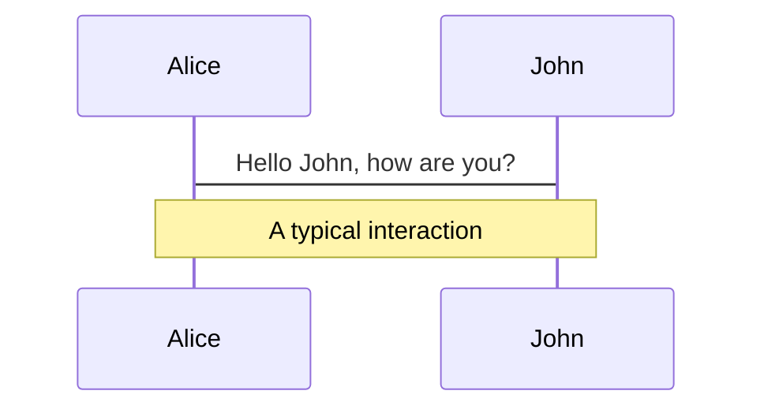
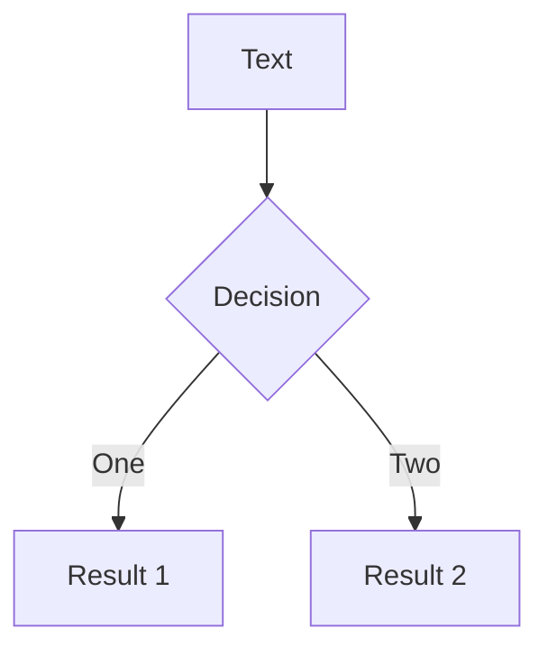
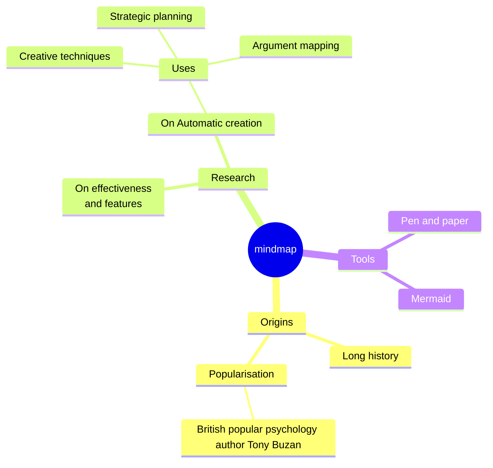
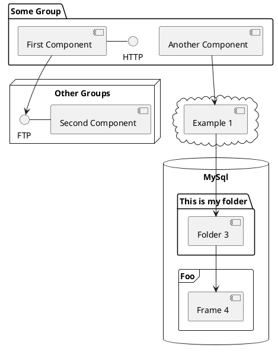

---
# try also 'default' to start simple
theme: seriph
# random image from a curated Unsplash collection by Anthony
# like them? see https://unsplash.com/collections/94734566/slidev
background: https://cover.sli.dev
# some information about your slides, markdown enabled
title:  Electron RISC-V Porting
info: |
  ## Slidev Starter Template
  Presentation slides for developers.

  Learn more at [Sli.dev](https://sli.dev)
# apply any unocss classes to the current slide
class: text-center
# https://sli.dev/custom/highlighters.html
highlighter: shiki
# https://sli.dev/guide/drawing
drawings:
  persist: false
# slide transition: https://sli.dev/guide/animations#slide-transitions
transition: slide-left
# enable MDC Syntax: https://sli.dev/guide/syntax#mdc-syntax
mdc: true
---

#  Electron RISC-V  Porting

## Presenter: kxxt \<rsworktech@outlook.com\>

## <logos-archlinux  /> Arch Linux RISC-V at PLCT Lab

---

# Contents

- What is Electron?
- Status of the RISC-V port
- How does Electron's build system work?
- Brief History of the RISC-V Port
- How does the RISC-V port work?
- A recent performance regression

---
transition: fade-out
---

# What is Electron ?

电子垃圾

It's a cross-platform framework for building desktop applications using web technologies.

<style>
h1.equ {
  font-size: 64px !important;
}  
</style>

<h1 class="equ"> <logos-electron size="74px"/> > <logos-chrome size="74px"/> + <logos-nodejs size="74px"/> (shared <logos-v8 size="74px"/>) </h1>


---
transition: slide-up
level: 2
---

# How does Electron's build system work?

DEPS and patches

- [Electron uses DEPS(invented by chromium) to manage dependencies](https://github.com/riscv-forks/electron/blob/v31.0.1-riscv/DEPS)
- After syncing the dependencies, a hook applies [tons of patches](https://github.com/riscv-forks/electron/tree/v31.0.1-riscv/patches) to chromium and nodejs source code
- It reuses chromium's build system(gn, ninja) to build the final electron binary
- So basically, electron's build system is a fork of chromium's build system

---

# How does Electron's build system work?

Chromium's build system

- Chromium maintains its own builds of clang and rust toolchain.
- The build system uses debian sysroots by default.

# How does this complicates the RISC-V port?

- To follow upstream's approach:
- [A separately maintained patch](https://github.com/riscv-forks/electron/blob/README/sysroot.patch) to create debian sysroots for riscv64.
- Chroimum's clang build is missing some riscv64 parts(e.g. compiler-rt), so for cross-compilation, [we need to build clang ourselves](TODO).
- Rust also needs to be built because of [#121924](https://github.com/rust-lang/rust/issues/121924). I fixed it in [#123612](https://github.com/rust-lang/rust/pull/123612). This fix has landed in rust 1.79.0 (Released on 13 June).

---

# Brief History of the RISC-V Port

- [OpenSUSE's port of electron to riscv64](https://build.opensuse.org/package/show/openSUSE:Factory:RISCV/nodejs-electron)
- electron22 ported to Arch Linux riscv64 based on OpenSUSE's port.
- Initially it's compiled directly on Arch Linux riscv64 (1day+ build time on 5950X via qemu-user).
- On SG2042, it could be built in 6 hours but [SG2042 can't build it reliably](https://github.com/revyos/revyos/issues/27).
  It's likely a kernel/firmware bug because it can't be reproduced on other riscv64 platforms.
- Later, I [established a fork](https://github.com/riscv-forks/electron) and get cross-compilation working.
  - It is also used in Arch Linux riscv64 to directly build on riscv64: https://github.com/felixonmars/archriscv-packages/tree/master/electron28

---
layout: image-right
image: branches.png
---

# How does the RISC-V port work?

Branch model

- For each upstream tag, a branch based on it is created.
- We need a branch because we might release multiple revisions for a single upstream tag.
- There are also branches like `main-riscv`. But they are rarely maintained.

---
layout: image-right
image: releases.png
---

# How does the RISC-V port work?

Release model
<style>
    li {
        font-size: 1.4rem !important;
        line-height: 1.8rem !important;
    }
</style>
[A separate repo](https://github.com/riscv-forks/electron-riscv-releases) is used to publish the releases because of
- The source repo is already used to publish toolchains 
- To avoid creating tags like v31.0.1.riscv1 in the source repo.
  - Electron's build system get its version from the git tag.
  - I don't want the built binaries to have a version like v31.0.1.riscv1, which might break the assumptions of some tools.

---
layout: image-right
image: releases.png
---

# How does the RISC-V port work?

Release model

In addition to tags like `v31.0.1.riscv1`, releases are also published to upstream tags like `v31.0.1` because
some poor electron tooling doesn't support the former tags well.

This creates a problem: there is only one upstream tag but multiple riscv revisions based on it.
I have no choice but to upload the latest revision to the upstream tag and clobber the old one.

---
layout: image-right
image: assets.png
backgroundSize: contain
---

# How does the RISC-V port work?

Release Assets

I publish what the upstream electron release publishes.

Thus, the release assets are fully compatible with the upstream electron release.

Except one difference: 

Upstream publishes debug zip files, but I can't publish them because for riscv they are too large and exceed the GitHub release asset size limit.
So I publish the zstd compressed debug tar files if their size is less than 2GB.

---

# How does the RISC-V port work (internally)?

- Re-use electron's existing patching infrastructure to apply RISC-V patches.
- For each electron major version, 

---
class: px-20
---

# Themes

Slidev comes with powerful theming support. Themes can provide styles, layouts, components, or even configurations for tools. Switching between themes by just **one edit** in your frontmatter:

<div grid="~ cols-2 gap-2" m="t-2">

```yaml
---
theme: default
---
```

```yaml
---
theme: seriph
---
```


</div>

Read more about [How to use a theme](https://sli.dev/themes/use.html) and
check out the [Awesome Themes Gallery](https://sli.dev/themes/gallery.html).

---

# Clicks Animations

You can add `v-click` to elements to add a click animation.

<div v-click>

This shows up when you click the slide:

```html
<div v-click>This shows up when you click the slide.</div>
```

</div>

<br>

<v-click>

The <span v-mark.red="3"><code>v-mark</code> directive</span>
also allows you to add
<span v-mark.circle.orange="4">inline marks</span>
, powered by [Rough Notation](https://roughnotation.com/):

```html
<span v-mark.underline.orange>inline markers</span>
```

</v-click>

<div mt-20 v-click>

[Learn More](https://sli.dev/guide/animations#click-animations)

</div>

---

# Motions

Motion animations are powered by [@vueuse/motion](https://motion.vueuse.org/), triggered by `v-motion` directive.

```html
<div
  v-motion
  :initial="{ x: -80 }"
  :enter="{ x: 0 }"
  :click-3="{ x: 80 }"
  :leave="{ x: 1000 }"
>
  Slidev
</div>
```

<div class="w-60 relative">
  <div class="relative w-40 h-40">
    
    
    
  </div>

  <div
    class="text-5xl absolute top-14 left-40 text-[#2B90B6] -z-1"
    v-motion
    :initial="{ x: -80, opacity: 0}"
    :enter="{ x: 0, opacity: 1, transition: { delay: 2000, duration: 1000 } }">
    Slidev
  </div>
</div>

<!-- vue script setup scripts can be directly used in markdown, and will only affects current page -->
<script setup lang="ts">
const final = {
  x: 0,
  y: 0,
  rotate: 0,
  scale: 1,
  transition: {
    type: 'spring',
    damping: 10,
    stiffness: 20,
    mass: 2
  }
}
</script>

<div
  v-motion
  :initial="{ x:35, y: 30, opacity: 0}"
  :enter="{ y: 0, opacity: 1, transition: { delay: 3500 } }">

[Learn More](https://sli.dev/guide/animations.html#motion)

</div>

---

# LaTeX

LaTeX is supported out-of-box powered by [KaTeX](https://katex.org/).

<br>

Inline $\sqrt{3x-1}+(1+x)^2$

Block
$$ {1|3|all}
\begin{array}{c}

\nabla \times \vec{\mathbf{B}} -\, \frac1c\, \frac{\partial\vec{\mathbf{E}}}{\partial t} &
= \frac{4\pi}{c}\vec{\mathbf{j}}    \nabla \cdot \vec{\mathbf{E}} & = 4 \pi \rho \\

\nabla \times \vec{\mathbf{E}}\, +\, \frac1c\, \frac{\partial\vec{\mathbf{B}}}{\partial t} & = \vec{\mathbf{0}} \\

\nabla \cdot \vec{\mathbf{B}} & = 0

\end{array}
$$

<br>

[Learn more](https://sli.dev/guide/syntax#latex)

---

# Diagrams

You can create diagrams / graphs from textual descriptions, directly in your Markdown.

<div class="grid grid-cols-4 gap-5 pt-4 -mb-6">









</div>

[Learn More](https://sli.dev/guide/syntax.html#diagrams)

---
foo: bar
dragPos:
  square: 691,32,167,_,-16
---

# Draggable Elements

Double-click on the draggable elements to edit their positions.

<br>

###### Directive Usage

```md

```
<v-drag-arrow pos="67,452,253,46" two-way op70 />

---
src: ./pages/multiple-entries.md
hide: false
---

layout: center
class: text-center
---

# Learn More

[Documentations](https://sli.dev) · [GitHub](https://github.com/slidevjs/slidev) · [Showcases](https://sli.dev/showcases.html)
